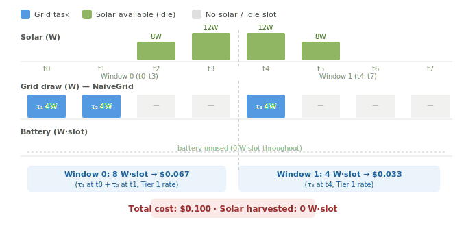
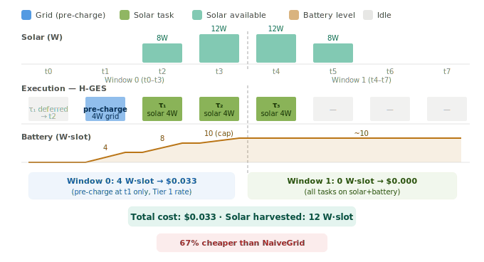
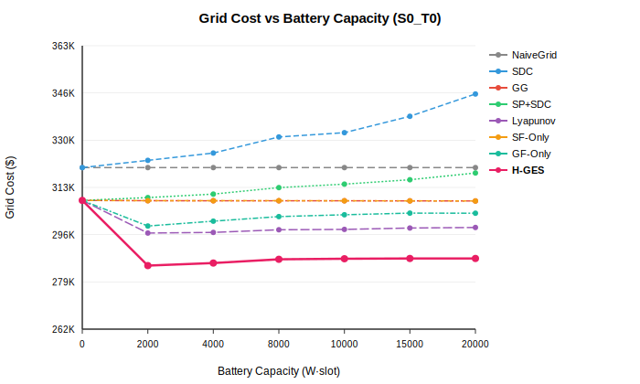
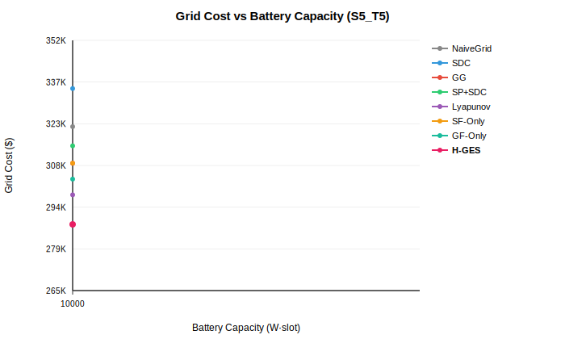
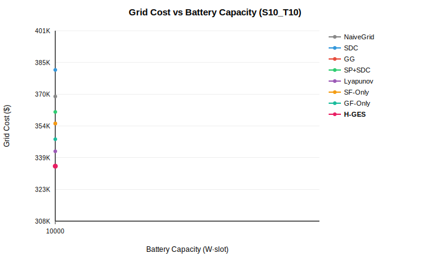
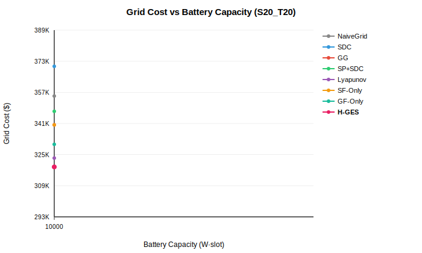
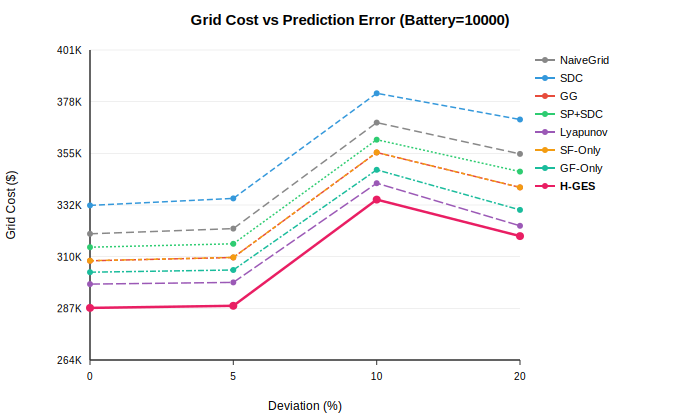
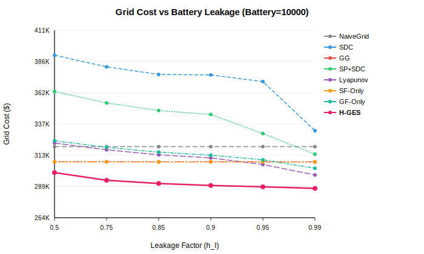

# H-GES: Hybrid Green Edge Server Scheduling for Autonomous Vehicles

Roadside edge servers supporting autonomous vehicles (AVs) must complete latency-sensitive compute tasks before hard deadlines, yet powering these servers from the grid is expensive — especially under tiered billing where peak-hour consumption is charged at premium rates. Solar is a natural remedy, but its intermittency and mismatch with task demand peaks means solar alone is insufficient. This repository implements **H-GES**, a three-algorithm framework that jointly optimises solar harvesting, selective battery pre-charging from cheap-tier grid power, and real-time online adaptation — minimising grid electricity cost while guaranteeing AV task completion under prediction uncertainty.

---

## 📁 Directory Structure

```
.
├── hges.cpp              # Full simulator: H-GES + all baselines (C++17)
├── plot_results.py       # SVG graph generator (no external dependencies)
├── run_all.sh            # One-shot: compile → experiments → graphs
├── Dataset/
│   ├── Real-life/
│   │   ├── power_reallife.csv      # Base solar power profile (1440 slots, 24 h)
│   │   └── task_reallife.csv       # Base AV task arrivals (id, arrival, deadline, util)
│   └── Deviation/                  # Auto-generated by hges on first run
│       ├── solar_dev_5pct.csv
│       ├── solar_dev_10pct.csv
│       ├── solar_dev_20pct.csv
│       ├── task_dev_5pct_spike_25pct.csv
│       ├── task_dev_10pct_spike_25pct.csv
│       └── task_dev_20pct_spike_25pct.csv
├── results/              # CSV outputs from experiments
│   ├── battery_sweep.csv
│   ├── error_sweep.csv
│   └── leakage_sweep.csv
├── graphs/               # SVG plots produced by plot_results.py
    ├── battery_sweep_S0_T0.svg
    ├── battery_sweep_S5_T5.svg
    ├── battery_sweep_S10_T10.svg
    ├── battery_sweep_S20_T20.svg
    ├── error_rate_bat10000.svg
    └── leakage_bat10000.svg

```

---

## ⚙️ Algorithm Descriptions

### System model

The edge server operates across three time scales: a **task slot** (15 ms) for AV compute scheduling, an **energy slot** (~1 min) for power accounting, and a **billing window** (1 hr, configurable) at which the grid invoice is settled. Server power follows a cubic utilization model $P = P_S + (P_{max}-P_S)(U/U_{max})^3$. Grid cost per billing window is tiered — the entire window's consumption is billed at a single rate, creating a non-convex incentive to stay below tier thresholds.

### H-GES (proposed) — three algorithms

**Algorithm 1 — Inter-Window Planner.** Before execution, sweeps candidate pre-charge fractions $\alpha$ $\in$ {0\%, 5\%, ..., 100\%} over predicted solar/task traces, then fine-tunes around the winner in 1% steps. The selected $\alpha$ balances the benefit of filling the battery cheaply against leakage losses.

**Algorithm 2 — Intra-Window Planner.** Executes each energy slot in four phases: (A) solar + battery discharge serve tasks from the offline EDF plan; (B) remaining deadline-constrained tasks draw from grid, with battery providing marginal support; (C) unused cheap-tier headroom charges the battery up to fraction $\alpha$; (D) residual solar surplus is banked.

**Algorithm 3 — Online Adaptation.** Corrects for solar forecast errors at runtime — surplus actual solar is banked; deficits are covered by battery discharge, remainder falls to grid. No re-planning needed.

**Offline solar pre-processing (shared).** An EDF greedy pass assigns tasks to solar slots offline, followed by a battery-leveling pass that shifts work from high-power slots to later low-power slots via battery storage.

### Baselines

| Method | Description |
|:-------|:------------|
| **NaiveGrid** | All tasks on grid at arrival; no solar or battery. Worst-case cost reference. |
| **PSG** (Planned Solar-Greedy) | Offline solar for fitting tasks; remaining tasks execute immediately on grid at arrival. |
| **SDC** | Online look-behind grid leveling via battery (charges valleys, discharges peaks). Solar-unaware. |
| **PSG+SDC** | Offline solar schedule + SDC for residual grid tasks; battery split between solar and grid buffers. |
| **Lyapunov** | Drift-plus-penalty online control: charges when virtual queue $Q(t) = \text{battery} - \theta < 0$, discharges when $Q > 0$. |
| **SF-Only** | H-GES with $\alpha = 0$ (no pre-charging). Grid only fills genuine solar+battery shortfalls. |
| **GF-Only** | H-GES with $\alpha = 1$ (always fills cheap-tier headroom). Ignores leakage cost. |

---

## 🔍 Sample Example: How H-GES Works

To build intuition, consider a simplified **8-slot, 2-window** horizon. We use a linear power model ($P = 4U$ W) and unit-utilization tasks. Three AV compute tasks arrive:

| Task | Arrival | Deadline | Utilization |
|:----:|:-------:|:--------:|:-----------:|
| τ₁ | t = 0 | t = 3 | 1 |
| τ₂ | t = 1 | t = 5 | 1 |
| τ₃ | t = 4 | t = 7 | 1 |

**Solar availability (W):** `[ 0,  0,  8, 12 | 12,  8,  0,  0 ]` — zero at night, peaks midday.
**Battery:** capacity = 10 W·slot, leakage $h_l = 0.99$.
**Billing:** 2 windows of 4 slots. Tier threshold = 16 W·slot/window. Rates: ≤16 → \$5/W-hr, >16 → \$10/W-hr.

---

### Naive Grid

Every task executes on grid the moment it arrives, ignoring available solar entirely.



τ₁ and τ₂ draw 4 W each from the grid at t=0 and t=1, while the solar at t=2 and t=3 sits idle. τ₃ draws 4 W at t=4. Window 0 accumulates 8 W·slot, Window 1 accumulates 4 W·slot — both within the cheap tier, but **zero solar is harvested**.

**Total cost: \$0.100** &nbsp;|&nbsp; Solar harvested: 0 W·slot

---

### H-GES

Algorithm 1 selects $\alpha = 0.5$: pre-charge the battery to half the cheap-tier headroom at t=1, so that solar-covered tasks in Windows 0 and 1 leave nothing for the grid.



- **t = 0:** No solar, battery empty. τ₁ is deferred to t=2 by the offline EDF plan.
- **t = 1:** No solar. Phase C pre-charges battery by 4 W from grid (cheap tier, well below threshold). Battery = 4 W·slot. Grid draw = 4 W.
- **t = 2:** Solar = 8 W. Phase A: τ₁ served on solar. Surplus 4 W → battery = 8 W·slot. Grid draw = 0.
- **t = 3:** Solar = 12 W. Phase A: τ₂ served on solar. Surplus 8 W → battery = 10 W·slot (capped). Grid draw = 0.
- **t = 4–7:** τ₃ served on solar at t=4. No further grid draw.

Window 0 grid = **4 W·slot** (pre-charge only). Window 1 grid = **0**.

**Total cost: \$0.033** &nbsp;|&nbsp; Solar harvested: 12 W·slot &nbsp;|&nbsp; **67% cheaper than NaiveGrid**

---

## 📊 Results

### Grid cost vs. battery capacity

Each plot shows total 24-hour grid cost across battery capacities for a given prediction error scenario. H-GES consistently achieves the lowest cost by adapting its pre-charge intensity to the available battery and leakage.

| No error (S0\_T0) | 5% deviation (S5\_T5) |
|:---:|:---:|
|  |  |

| 10% deviation (S10\_T10) | 20% deviation (S20\_T20) |
|:---:|:---:|
|  |  |

### Grid cost vs. prediction error rate

Fixed battery = 10,000 W·slot. As prediction error grows, purely offline methods (GG) degrade faster. H-GES's online adaptation (Algorithm 3) maintains cost stability.



### Grid cost vs. battery leakage

Fixed battery = 10,000 W·slot, no prediction error. GF-Only degrades sharply at high leakage; H-GES adapts $\alpha$ to the leakage level.



---

## 🚀 Usage

### Build

```bash
g++ -O2 -std=c++17 -o hges hges.cpp
```

### Run (manual, flag-by-flag)

```bash
# Battery capacity sweep — no prediction error, leakage = 0.99
./hges \
    --battery 0 2000 4000 8000 10000 15000 20000 \
    --solar_dev 0 --task_dev 0 \
    --spike 25 --leakage 0.99 \
    --output results/battery_sweep.csv

# Prediction error sweep — fixed battery = 10,000
./hges \
    --battery 10000 \
    --solar_dev 0 5 10 20 \
    --task_dev  0 5 10 20 \
    --spike 25 --leakage 0.99 \
    --output results/error_sweep.csv

# Leakage sensitivity — fixed battery = 10,000, no error
./hges \
    --battery 10000 \
    --solar_dev 0 --task_dev 0 \
    --spike 25 --leakage 0.75 \
    --output results/leakage_0.75.csv
```

**Flag reference:**

| Flag | Description | Default |
|:-----|:------------|:--------|
| `--battery` | Battery capacities in W·slot (space-separated) | `10000` |
| `--solar_dev` | Solar prediction deviation % (paired with `--task_dev`) | `0` |
| `--task_dev` | Task arrival deviation % (paired with `--solar_dev`) | `0` |
| `--spike` | Spike intensity % added at shock slots | `25` |
| `--leakage` | Battery leakage factor $h_l$ per slot | `0.99` |
| `--billing` | Billing window size in energy slots | `60` |
| `--tier_th` | Tier thresholds: `θ1 θ2` in W-hr/hr | `120 240` |
| `--tier_price` | Tier rates: `c1 c2 c3` in \$/W-hr | `5 7 10` |
| `--output` | Output CSV filename | `results.csv` |

**Custom pricing examples:**

```bash
# Steeper peak penalty
./hges --battery 10000 --solar_dev 0 --task_dev 0 \
       --tier_th 80 160 --tier_price 3 6 15 --output results/steep.csv

# Two-tier flat pricing
./hges --battery 10000 --solar_dev 0 --task_dev 0 \
       --tier_th 200 400 --tier_price 4 4 8 --output results/flat.csv
```

### Run everything at once

```bash
chmod +x run_all.sh && ./run_all.sh
```

### Generate graphs from existing CSVs

```bash
python3 plot_results.py \
    --csv results/battery_sweep.csv results/error_sweep.csv results/leakage_sweep.csv \
    --outdir graphs/
```

---

